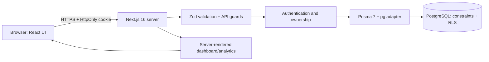

# System Architecture

## Overview

ExpenseTrack is a server-rendered three-tier web application. The browser never connects directly to PostgreSQL.

## Layers

- Presentation: `app/page.tsx`, auth pages, protected pages, client managers, loading/error/not-found files, theme and charts.
- Request boundary: route handlers validate origin, content type, JSON, Zod schemas, authentication, and ownership.
- Domain: `lib/finance.ts` contains pure financial calculations; `lib/finance-data.ts` maps real records into dashboard/analytics view data.
- Authentication: `lib/auth` creates random tokens, stores SHA-256 hashes, hashes passwords with Argon2id, and resolves current sessions server-side.
- Data: Prisma produces parameterized SQL; `lib/database-context.ts` adds transaction-local user/session/login context used by PostgreSQL policies.
- Infrastructure: `proxy.ts` provides nonce-based Content Security Policy; `next.config.ts` adds standard security headers.

## Main request flows

### Authenticated resource mutation

1. Browser sends same-origin JSON with the HttpOnly session cookie.
2. Route validates origin and content type before parsing.
3. Session token is hashed and queried; only safe user fields are selected.
4. Zod validates the body.
5. A transaction-local `app.current_user_id` is set.
6. Category/resource ownership is checked with both resource ID and user ID.
7. Prisma issues parameterized queries; database constraints and RLS add defense in depth.
8. API returns a consistent JSON result without hashes or secrets.

### Analytics

The server loads owned transactions and budgets for bounded month ranges, converts Prisma Decimal values for display, and applies pure aggregation helpers. No chart uses mock data.

## Design decisions

- Database sessions make revocation immediate and work across multiple Next.js instances.
- Database rate limits work across instances; serializable transactions prevent lost concurrent increments.
- Offset pagination is appropriate for a student-scale ledger and bounded page sizes.
- Charts use semantic HTML/CSS rather than a large dependency.
- Public SEO describes a WebApplication, not a LocalBusiness, because accuracy is more important than adding irrelevant schema.
