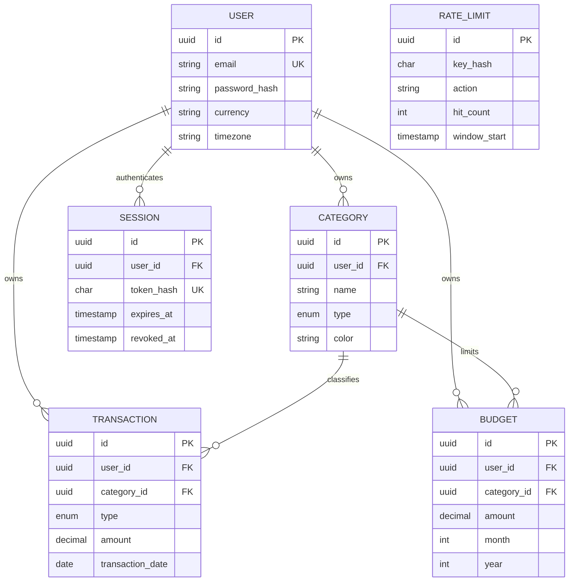

# Database Design and Relationships

## Integrity rules

- UUID primary keys prevent guessable sequences.
- User email and session-token hash are unique.
- Category name/type is unique per user.
- Budget category/year/month is unique per user.
- Transaction and budget amounts must be positive; decimal(14,2) prevents floating-point storage errors.
- Budget month is 1–12 and year is 2000–9999.
- Session hashes must be 64 lowercase hexadecimal characters and expiry must follow creation.
- User deletions cascade to owned data; categories referenced by finance records are restricted from deletion.
- Ownership/date/category indexes support common filters and summaries.

## Row-level security

RLS is enabled on `users`, `categories`, `transactions`, `budgets`, `sessions`, and `rate_limits`. User tables compare their owner ID with a transaction-local setting. Authentication policies temporarily permit only the matching login email, session hash, or registration transaction. Rate-limit keys are one-way hashes and are accessible only through the server database role.

PostgreSQL table owners bypass ordinary RLS. Production must therefore use a non-owner runtime role and a separate owner/migration role; see deployment instructions. Application-level `userId` conditions remain mandatory even with RLS.

## Migrations

Migrations are ordered under `prisma/migrations`. Development creates/reviews migrations; production runs only `prisma migrate deploy`. Never use reset, forced push, or data-loss flags against production.
